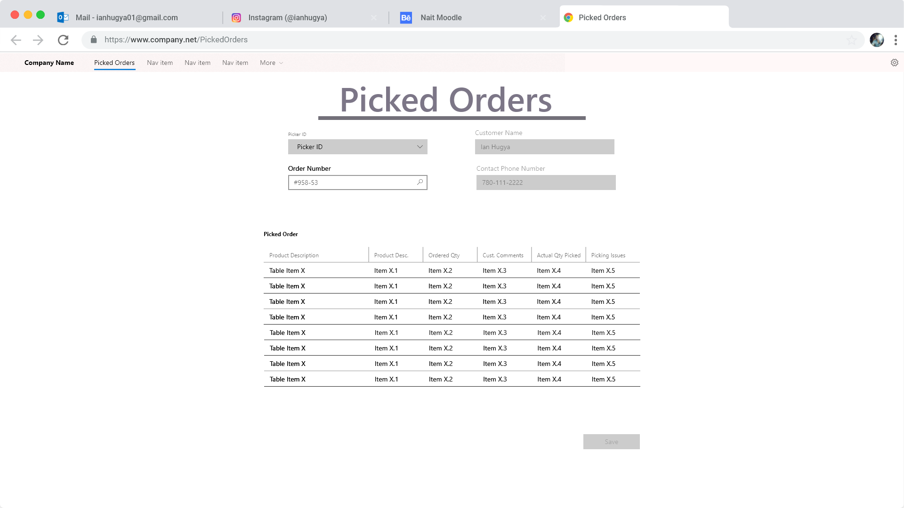
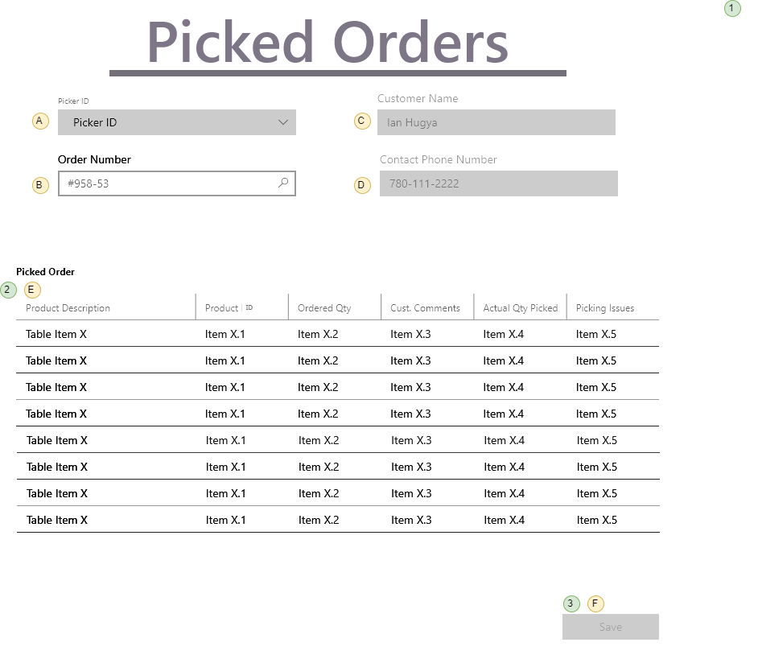

# Order Processing

> Orders are shipped directly from our suppliers to our customers. As such, suppliers log onto our system to see what orders there are for the products that they provide.

## User Interface

Suppliers will be interacting with a page that shows the following information.



The information shown here will be displayed in a **ListView**, using the *EditItemTemplate* as the part that shows the details for a given order.

### Events and Interactions



-  - **Page_Load** event
  -  - Load the list of PickerIDs
  - **`List<Pickers> PickedOrderProcessingController.ListPickers()`**
  -  - Clerk enters in the Order Number
    - **`List<Orders> PickedOrderProcessingController.ListOrders(orderNumber)`**
  -  - Customer names obtained from the Order Number Control.
    - **`List<OrderSelection> PickedOrderProcessingController.ListCustomers(orderNumber)`**
  -  - Customer Phone Number obtained from the Order Number Control.
    - **`List<OrderSelection> PickedOrderProcessingController.ListCustomers(orderNumber)`**
-  - **EditCommand** click event
  - Default EditCommand behaviour of the ListView
  - `<EditItemTemplate>` will display the extended information of the Orders List  and other order information.
-  - **SaveOrder** click 
    - ![] - Customer/Order names obtained from the  OrderNumber and Customer Name controls
  - Use a custom command name of "SavePickedOrder" and handle in the ListView's ItemCommand event.
  - Gather information from the form for the products to be shipped and the shipping information. This is sent to the **`void OrderProcessingController.SavePickedOrder(int orderNumber)`**

## POCOs/DTOs

The POCOs/DTOs are simply classes that will hold our data when we are performing Queries or issuing Commands to the BLL.

### Queries

```csharp
public class PickerSelection
{
    public int ShipperId { get; set; }
    public string Picker { get; set; }
}
```

```csharp
public class CustomerInfo
{
    public int OrderNumber { get; set; }
    public string CustomerName { get; set; }
    public int PhoneNumber { get; set; }
}
```
```csharp

```csharp
public class OrderProductInformation
{
    public string ProductDescription {get;set;}
    public int ProductId {get;set;}
    public short OrderedQty {get;set;}
    public string CustomerComments {get;set;}
    public short QtyPicked {get;set;}
    public string PickingIssues {get;set;}
    
}
```

### Commands


```csharp
public class ProductPicked
{
    public int ProductId { get; set; }
    public int QtyPicked { get; set; }
}
```

## BLL Processing

All product shipments are handled by the **`PickedOrderProcessingController`**. It supports the following methods.

- **`List<Pickers> PickedOrderProcessingController.ListPickers()`**
  - **Validation:**
    - Make sure the OrderNumber exists, otherwise throw exception
  - Query for outstanding orders, getting data from the following tables:
- **`List<Orders> PickedOrderProcessingController.ListOrders(orderNumber)`**
  - Queries for all the shippers.
- **`void OrderProcessingController.SavePickedOrder(int orderNumber)`**
  - **Validation:**
    - OrderId must be valid
    - PickedOrder cannot be an empty list
    - Products identified must be on the order
    - Quantity must be greater than zero and less than or equal to the quantity outstanding
  - Processing (tables/data that must be updated/inserted/deleted/whatever)
    - Create new issue
    - Add products
   
